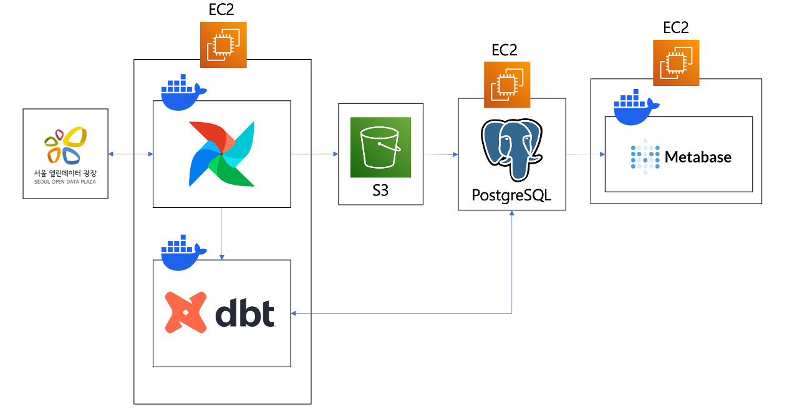

# seoul-airflow
## 프로젝트 소개
서울시 Open API를 활용한 데이터 파이프라인 구현 및 대시보드 구성

## 폴더 구조
    .
    ├── airflow/                # Airflow 관련
    │   ├── dags/
    │   │   └── sql/
    │   └── plugins/
    │
    ├── dbt/                    # dbt 관련
    │   ├── macros/
    │   └── models/
    │       ├── staging/
    │       ├── intermediate/
    │       └── marts/
    │
    ├── scripts/                # 일회성 스크립트
    │
    ├── docker-compose.yml
    ├── sample.env
    └── README.md

## 실행 방법
### 1. 환경 변수 설정 파일 .env 생성 (수동 작업)
- (local) sample.env 파일 참고하여 같은 위치에 .env 파일 생성
- (EC2) /home/ec2-user/.env 파일 생성

### 2. 이미지 빌드
    docker compose build

### 3. 서비스 실행
    docker compose up -d

### 4. Airflow 웹 UI 에서 등록
#### Variables
- s3_bucket_name
- seoul_api_key
- slack_url
#### Connections
- conn_aws
- conn_postgres